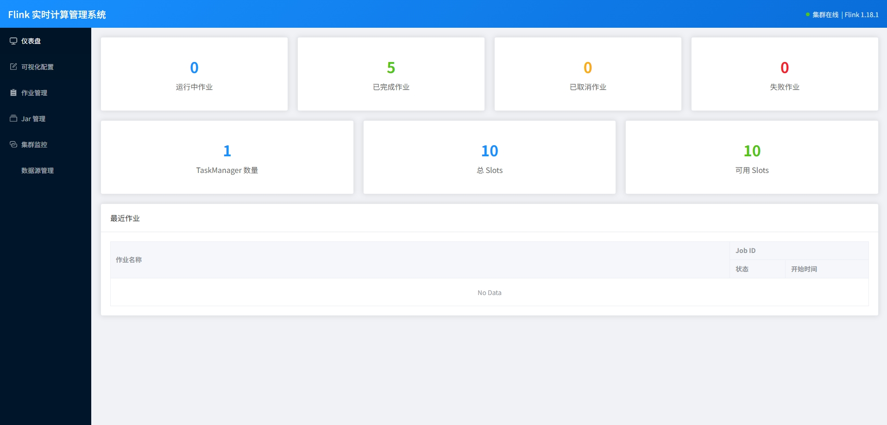
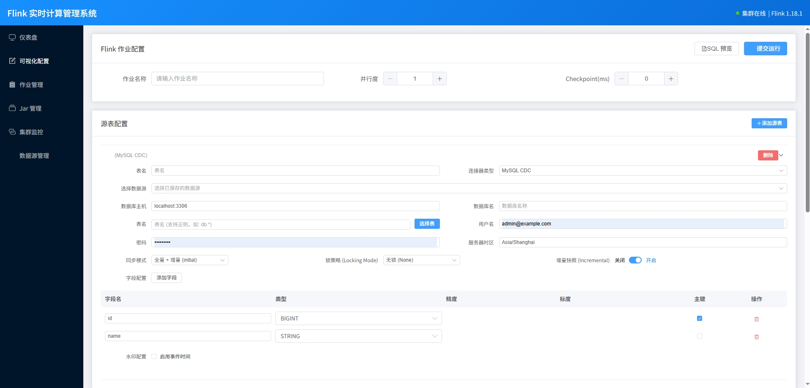
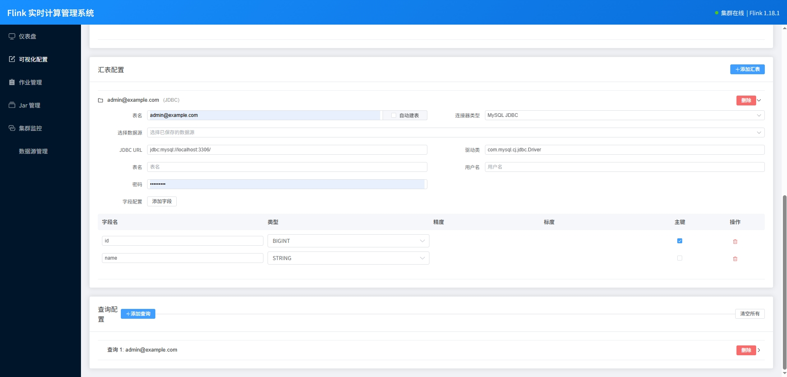
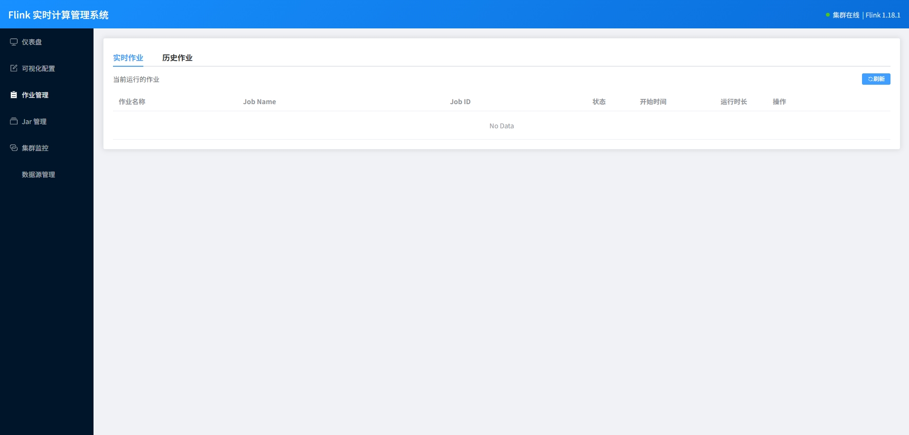
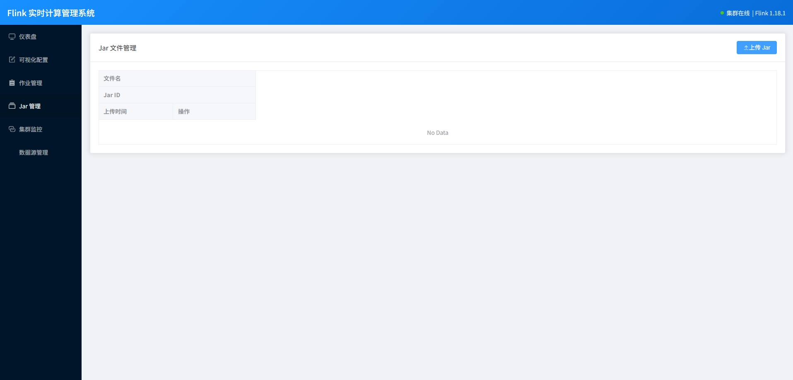
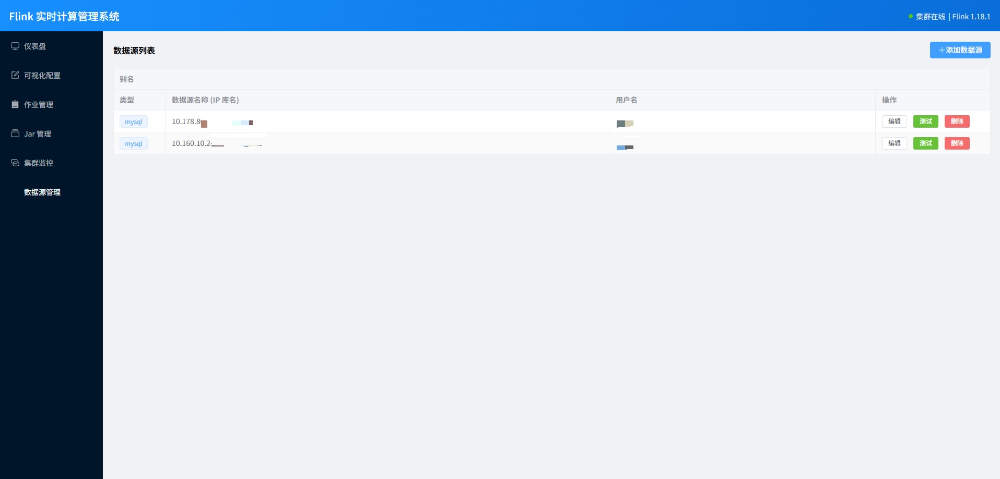

# Flink Manager (Flink SQL 管理平台)

Flink Manager 是一个轻量级的 Web 平台，专为简化 Apache Flink SQL 作业的开发、提交和运维而设计。它提供了一个直观的界面来构建 SQL、管理数据源、监控作业状态以及处理 Savepoint。

## 🚀 主要功能

*   **可视化 SQL 构建**：通过表单配置生成复杂的 Flink SQL（Source/Sink/Transform），无需手动编写冗长的 `WITH` 参数。
*   **多连接器支持**：
    *   **Source**: MySQL CDC (支持增量快照/无锁读取), Kafka, JDBC 等。
    *   **Sink**: JDBC (MySQL/PostgreSQL/Oracle), Kafka, StarRocks, Doris, ClickHouse 等。
*   **作业生命周期管理**：
    *   一键提交 SQL 或 JAR 作业。
    *   实时停止/取消作业。
    *   **Savepoint 管理**：手动触发 Savepoint，支持从历史 Savepoint 恢复作业。
*   **数据源管理**：集中管理数据库连接信息，支持连接测试，通过配置数据源，可一键注入到flink sql配置中，无需填写连接信息
*   **自动获取表结构**：选择数据源后，可自动获取表结构
*   **自动建表**：选择 好汇表数据源后，可关联源表结构，自动在目标库建表
*   **自动生成flink-sql**：配置好源表、汇表、查询SQL后，可自动生成flink-sql，通过gate-way提交到flink
*   **运维友好**：
    *   **自动容错**：针对 MySQL CDC 的 `table-name` 格式自动修正。
    *   **性能调优**：内置 JDBC Sink 批量写入与重试策略配置。
    *   **锁策略配置**：支持自定义 Debezium 锁模式 (None, Minimal, Table) 以适应不同权限环境。

## 🛠️ 技术栈

*   **后端**: Python 3.10+ (FastAPI, SQLAlchemy, Pydantic)
*   **前端**: Vue.js 3 (Element Plus) - 目前作为静态资源集成
*   **引擎**: Apache Flink (通过 REST API 交互)
*   **数据库**: MySQL (用于存储作业元数据)

## 📂 目录结构

```
Flink_manger/
├── backend/            # Python 后端代码
│   ├── main.py         # FastAPI 入口
│   ├── config.py       # 配置文件
│   ├── database.py     # 数据库连接
│   ├── flink_client.py # Flink REST API 客户端
│   └── ...
├── frontend/           # 前端资源
│   └── dist/           # 编译后的静态文件 (index.html)
├── logs/               # 运行日志
└── README.md           # 项目说明
```

## 🔧 快速开始

### 1. 环境准备

*   Python 3.8+
*   MySQL 5.7+ (用于存储平台元数据)
*   Apache Flink Cluster (1.13+ 推荐)

### 2. 安装依赖

```bash
pip install -r requirements.txt
# 或者手动安装核心依赖
pip install fastapi uvicorn sqlalchemy pymysql requests pydantic
```

### 3. 配置数据库

修改 `backend/database.py` 或环境变量中的数据库连接信息，确保指向正确的 MySQL 实例。平台启动时会自动初始化所需的表结构 (`flink_jobs`, `flink_savepoints` 等)。

### 4. 启动服务

```bash
# 在项目根目录下运行
python -m uvicorn backend.main:app --host 0.0.0.0 --port 8000 --reload
```

访问浏览器 `http://localhost:8000` 即可使用。

## 📝图片展示














## 🤝 下一步计划

目前仅支持MySQL - mysql 实时同步，下一步支持多源数据库，写入Starrocks、Doirs、click house
